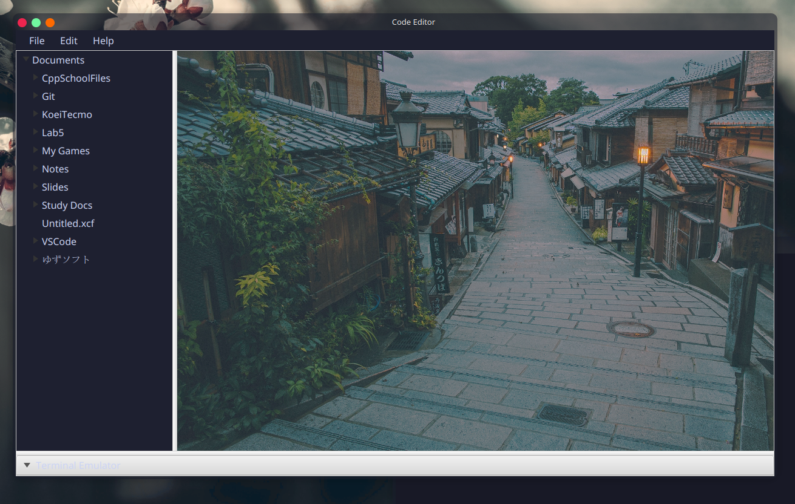
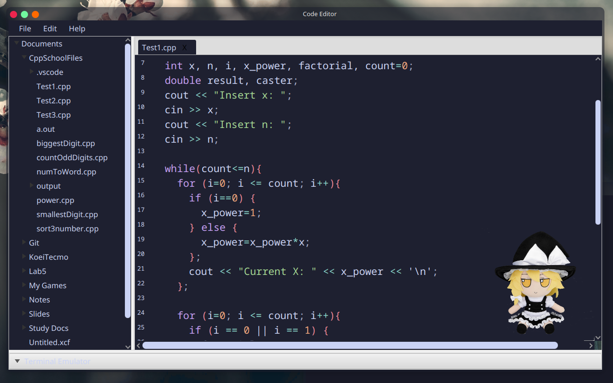
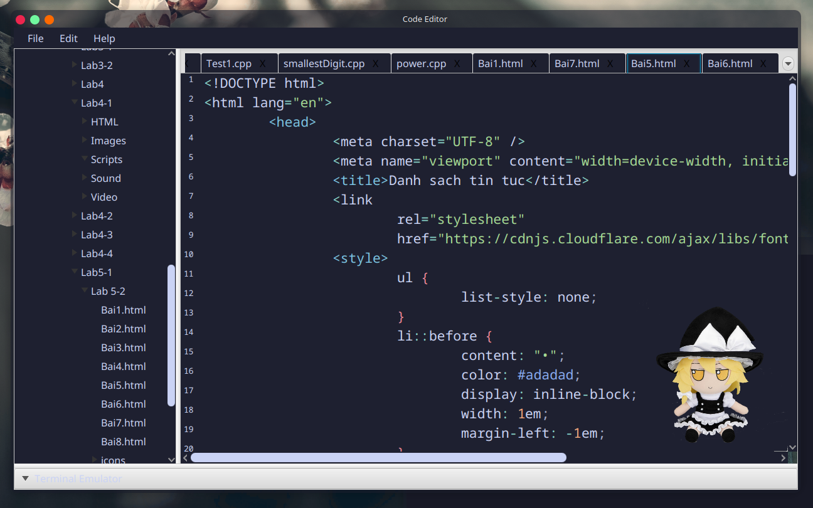
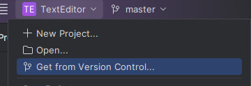

# Simple Java Code Editor Exercise

- Multiple Tab code editing
- Syntax Highlighting, support for many language (Java, Python, C++, etc)
- Theme Styling Support using css

## Some images

## How to run
- You can clone the repository using IntelliJ IDEA's version control, should work right away
> https://github.com/AtelierMizumi/JavaFX-CodeEditor
> 

## Known issues:
- Lots of unused classes & functions to be added
- Some elements wasn't styled
- Developed, ran and tested using Linux platform, might not work on Windows (remember to chage the home path in MainController.java)
- TerminalFX dependency wasn't updated for 1.5 years, worked partially with lots of errors (again only tested on Linux)

Any issues or suggestions, feel free to contact me at <a href="mailto:email@example.com">this email</a>